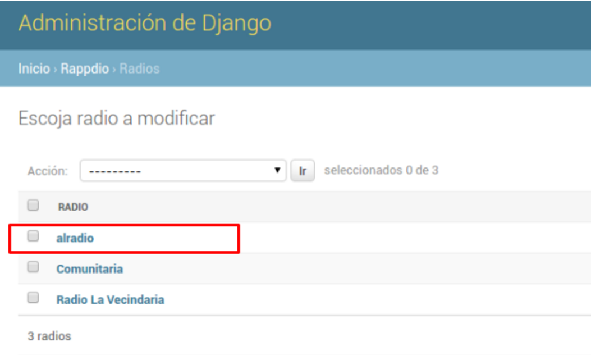
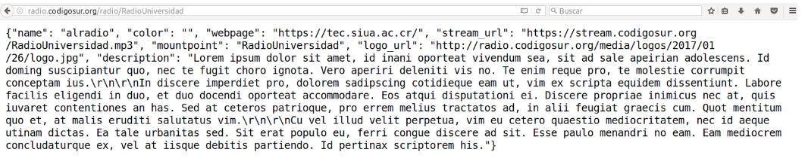
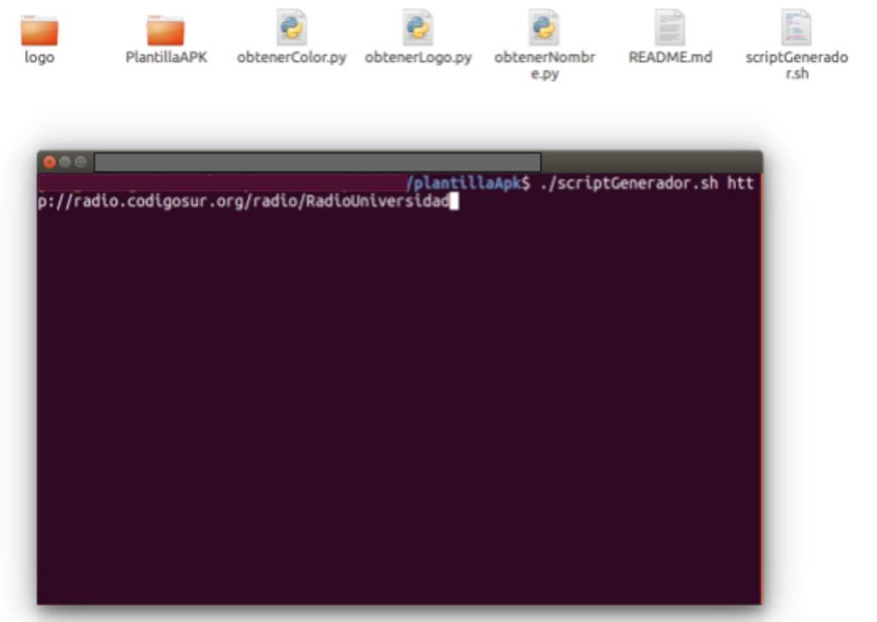
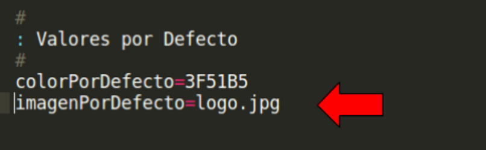
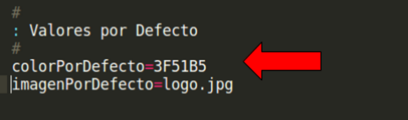

# Manual Técnico 

## Información General
La aplicación se desarrolló con Android Studio, utilizando únicamente herramientas propias de Android. Lo que es la implementación del código está hecho en java.

El código de este proyecto se puede consultar en el siguiente link: `https://github.com/josetito/plantillaApk` 

Esta aplicación se implementó para la plataforma de celulares con sistema operativo Android. Se soporta los sistemas con Android superior a 4.0. 

El scriptGenerador es un script de bash, esto lo decidimos debido a que este lo usamos para podernos desplazar entre los directorios del proyecto para realizar algunos cambios que son necesarios.

Los scripts de python se usan porque son tareas de más alto nivel y con este lenguaje nos facilitaba mucho más la tarea. Estos scripts lo que hacen es consultar el Json y devolver sólo una parte específica del Json. En nuestro caso las partes del Json que consultamos con estos scripts son: color, logo y nombre.

### Herramientas
* Android Studio
* AVD (Android virtual Device)
* Git

### Dependencias
* Java 8
* Python 2.7

## Instalación

1. Instalar java 8
```
http://docs.oracle.com/javase/8/docs/technotes/guides/install/linux_jdk.html#BJFJJEFG
```

2. Instalar python 2.7
```
https://www.python.org/downloads/
```

3. Clonar el proyecto
```
$ git clone git@github.com:josetito/plantillaApk.git
```

4. Darle permisos de ejecución al script 
```
$ chmod +x scriptGenerador.sh
```


## ¿Como crear una aplicación?

>**Nota:** Para seguir este tutorial es necesario haber instalado la aplicación. En caso contrario ir al apartado de instalación y seguir los pasos. 

### **Paso 1:**  
Verificar que a la radio a la que voy a crear la aplicación móvil, haya llenado el formulario que está en: `http://radio.codigosur.org/admin/rappdio/radio/`

<p align="center">

</p>


#### **Paso 2:**  
Luego debemos ir a consultar cual es el Json de la radio que queremos crear, y para eso necesitamos saber cual es el punto de montaje. Podemos probar en el navegador con el siguiente ejemplo: 
```
http://radio.codigosur.org/radio/ + punto de montaje
verificar que el Json está en ese link
```
>**Nota:** Ahora copiamos el link que lo vamos a necesitar en el siguiente paso. 
Ejemplo:

<p align="center">

</p>

### **Paso 3:**  
Vamos a la carpeta donde está el proyecto y abrimos una terminal. Debemos estar en el directorio donde esté el proyecto y los scripts. Y ejecutamos el script y pegamos la url que copiamos en el paso anterior, el comando queda de la siguiente forma:

```
$ ./scriptGenerador.sh http://radio.codigosur.org/radio/RadioUniversidad
```

<p align="center">

</p>
### **Paso 4:** 
Al terminar el paso anterior el script terminará con un mensaje de Listo.  Y nos dejará en la carpeta con el nombre de la radio un archivo .apk listo para instalar en el teléfono.


**Listo!** 

## Valores por defecto

El proyecto cuenta con algunos valores por defecto que pueden ser cambiados en cualquier momento.

#### El logo por defecto:
Para cambiar el logo por defecto en caso de que la radio se hubiera creado en el formulario sin un logo, lo que se hace es tomar la imagen que está en la **carpeta logo**, esta carpeta está en el proyecto y puede ser modificada por cualquier otra imagen pero la nueva imagen debe de llamarse **logo**. 

Luego debe ir y modificar el `scriptGenerador.sh` en la sección de **valores por defecto** y modificar la variable **imagenPorDefecto** de modo que el nombre y la extención de la imagen consida con la nueva imagen que colocamos en la carpeta logo.

<p align="center">

</p>

>**Nota:** Guardamos para que los cambios se conserven.


#### El color por defecto: 
En el caso de que en el formulario no se asigne un color predeterminado para la aplicación se usa un color por defecto.

Para poder modificar este valor por cualquier otro valor RGB se debe de ir al `scriptGenerador.sh` en la sección de **valores por defecto** y modificar la variable **colorPorDefecto**.

<p align="center">

</p>

>**Nota:** Guardamos para que los cambios se conserven.


